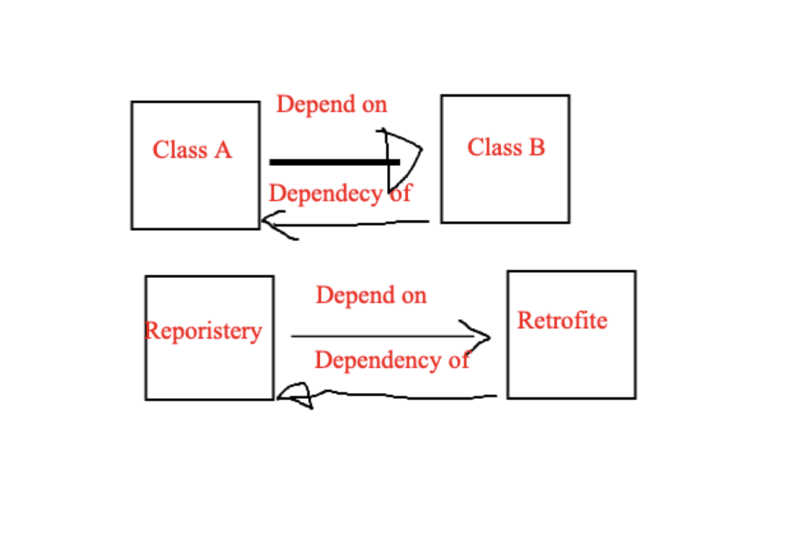
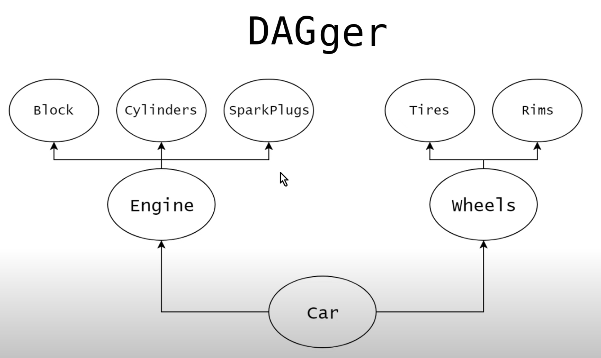

# Dagger

Dagger is a fully static, compile-time dependency injection framework for Java, Kotlin, and Android
It is created by Square and now maintained by Google. we use it to automate DI for our application

### Meaning of dependency and injection

if class is depend on anther class like `Class A`  is depend on `Class B` that mean class A has
reference of Class B like this image Injection simply means passing dependency from outside class
the idea

# Benefits of Dagger

- Reduce boilerplate code
- Decoupled build dependencies
- improving testing | Classify Dependency |:---------------------------:| :
  | 

### Example how dagger reduce boilerplate code

```kotlin
   class Care(val engine: Engine, val wheels: Wheels) {
    fun drive() {

    }
}
```

```kotlin
   fun main() {
    val blocks = Block()
    val cylinder = Cylinder()
    val engine = Engine(blocks, cylinder)
    val wheals = Whelas(Tires(), Rimes())
    val car = car(engine, wheals)
}
```

## Using dagger will reduce

```kotlin
   fun main() {
    val carComponet = DaggerCarComponent.create()
    val car = carComponet.getCar()
}
```

Class car depend on two class engine and wheels let is start how dagger work to provide automated
dependency

`Dependancy ` provide using annotation `@Inject` you can add it for classes can edit on them another
way using `@Module` and you can provide object using `@Provides`
` Creator ` that responsible for create DAG Dependency Ayclic Graph using annotation `@Component`

### Example create dependency for object Car according this graph



## Create Dependency

- First create CareComponent as interface this is backbone initialize DAG
  ```kotlin @Component interface CareComponent { fun getCar():Care }```

## Two way dagger working to get object for Graph dependency

- Using injection annotation  `@inject` if you can inject Constructor for your classes that mean we
  can edit at this classes for example `Car`,`Engine`
- Using class module and annotation `@Module` above class and add this class to modules for
  component to know another way provide object check `WhealsModule`
  and using `@provides` top the method provide object

```kotlin
   @Module
class WhealsModule {

    @Provides
    fun provideRimes(): Rimes = Rimes()
}
```

## Other annotation help us to pro

- We can use `@Binds` with `Module` that provide instance for abstraction class for exammle `PetrolEngine` Implement `Engine` Interface
  and `Car` class depend on Engine to provide it create as like `PetrolEngineModule`
```kotlin
     @Module
     abstract class PetrolEngineModule {
     @Binds
      abstract fun bindPetrolEngine(petrolEngine: PetrolEngine): Engine
        }
  ```
- We can use `@Named` if provide same type object different way and want to determine which one can used at injection if used many at our project 
  then we can create modifier to avoid mistake write name Correctly using Qualifier like `@Capicty` , `@HorsePower`  
- we can inject value of object at run time that check file `DiesleEngineModule`
- We can using `@Singleton` in case of want one object used inside apps 
- We cane use `@Component.Builder` another way bind value at runtime create your specific builder for daggerComponent we will create interface inside
 ```kotlin
   @Component.Builder
    interface Builder {
  @BindsInstance
  fun bindHorseBower(@HorsePower horsePower: Int): Builder// this value bind any int if object need inject ant value

  @BindsInstance
  fun bindCapacity(@Capacity capacity: Int): Builder

  fun getComponent(): CareComponent
    }
```
##Custom Scope 
If one dependency at component different scope like `Driver` class want to one object per application and one care creation per ActivityScope
so we create `AppCoponent` and object will be the scope like `Driver` take scope Singleton 
```kotlin
  @Singleton
@Component
interface AppComponent {
  fun getDriver(): Driver
}
```
the create scope for activity called `ActivityScope` add it to ActivityComponent and it to provide scope activity like `Car`
```kotlin
 @ActivityScope
@Component(
  dependencies = [AppComponent::class],
  modules = [WhealsModule::class, PetrolEngineModule::class]
)
interface ActivityComponent {

  fun getCar(): Care
  fun inject(mainActivity: MainActivity)

  @Component.Builder
  interface Builder {
    @BindsInstance
    fun bindHorseBower(@HorsePower horsePower: Int): Builder// this value bind any int if object need inject ant value

    @BindsInstance
    fun bindCapacity(@Capacity capacity: Int): Builder
    fun appComponent(appComponent: AppComponent): Builder
    fun build(): ActivityComponent
  }
}
```
according above code you see activity component used dependencies `Appcomponent` to provide object for app scope 
there is another solution you can use annotation `@SubComponnet` this solution solve problem if another object want to be scope application 
component that easy add `@Singleton` annotation at provide object but you must be add it AppComponent like `getDriver()` method
Let you want `DiselEngine` singleton scope app if we not use subcomponent you need add `@Singleton` for provide method
and new method AppComponent 
```kotlin
@Singleton
@Component(modules = [DieselEngineModule::class])
interface AppComponent {
  fun getDriver(): Driver
  fun getDieselEngine(): Engine

  @Component.Builder
  interface Builder {
    @BindsInstance
    fun bindHorseBower(@HorsePower horsePower: Int): Builder// this value bind any int if object need inject ant value

    fun binDieaselModule(dieselEngineModule: DieselEngineModule):Builder

    fun build():AppComponent
  }
}
```
Look above code we find add method getDieselEngine method and modules provide `DieselEngineModule` to app component add new builder 
because need provide bind instance for horse power so DieselEngine need it to provide Object 
If you want new object at the scope of AppComponent must be add method like 
```kotlin
 fun getDriver(): Driver
  fun getDieselEngine(): Engine
```
This problem and Dagger find solution Use sub component so AppComponent like This
```kotlin
@Singleton
@Component(modules = [DieselEngineModule::class])
interface AppComponent {
    fun getActivityComponent(): ActivityComponent // get only for subComponent that depend on AppComponent 

    @Component.Builder
    interface Builder {
        @BindsInstance
        fun bindHorseBower(@HorsePower horsePower: Int): Builder// this value bind any int if object need inject ant value
        @BindsInstance
        fun bindCapacity(@Capacity capacity: Int): Builder// this value bind any int if object need inject ant value

        fun binDieaselModule(dieselEngineModule: DieselEngineModule): Builder

        fun build(): AppComponent
    }
}
```
